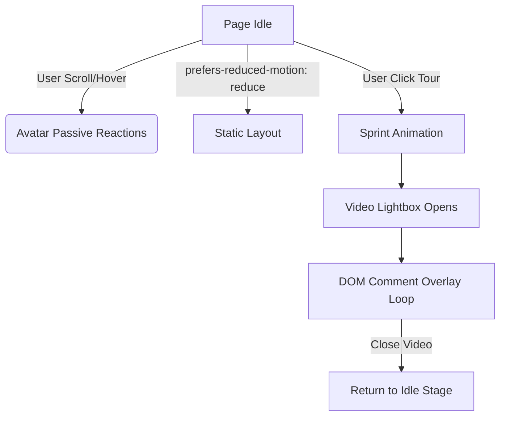

# Interaction Design — Avatar & Video Fourth-Wall System

**Path:** `~/Projects/mike-wolf-com/rebrand-2026/concepts/INTERACTION-DESIGN.md`  
**Role:** Interaction specification for avatar sprites and video collaboration tour  
**Status:** Completed (Ralph Loop R5)  
**Authorship:** Antigravity (Gemini 3.5 Flash) · 2026-07-12 · Mike principal  

---

## 1. System Architecture

The interaction layer operates on a **static-first, zero-framework** ethos. All animations are driven by CSS keyframes or lightweight, event-driven Vanilla JS to avoid CPU thrashing and layout reflows.



---

## 2. The Avatar System (Mike & Colleague Sprites)

To avoid layout shifts (CLS) and accessibility frustration, sprites do not float freely across the entire viewport. They are bound to specific **stages** (bounding containers).

### The Bounding Stages
1. **The Header Stage (Desktop Nav):**
   * A small area (~120px wide) next to the `MIKE WOLF` wordmark.
   * **Mike Sprite:** Casual standing pose.
2. **The Colleague Stage (SOMA Widget Tab):**
   * Located at the bottom right, next to the SOMA manager console.
   * **Colleague Sprite (Dee/Claude):** A teal abstract glyph or named tag.

### Responsive Behavior & Assets
* **Desktop (>640px):** Sprites are fully active, responding to cursor proximity and idle timers.
* **Mobile (≤640px):** Sprites are docked inside the SOMA widget or navigation header as static inline elements. No dynamic movement or float behavior to prevent screen blocking.
* **Accessibility:** All sprite speech bubbles or status changes use `aria-live="polite"` regions so screen readers receive updates without focal disruption.

### Passive/Idle State Machine

```
[Idle Pose] 
    │
    ├─► (No interaction for 30s) ──► [Deep Breathing / Typo Fix animation]
    ├─► (Cursor approaches header) ──► [Avatar eyes track cursor]
    └─► (User highlights text) ──► [Avatar shrugging/acknowledging]
```

* **Typo Fix Animation:** Mike sprite walks 10px to the left, uses a broom/pixel-brush to sweep a stray character, and walks back.
* **Typo Restoration:** The page immediately restores the character. Mike shrugs. (No physical DOM elements are resized).

---

## 3. The Video-Box Fourth-Wall System

The central feature is the **Tour Video** card. When clicked, it initiates a coordinated transition across the page.

### Step 1: The Click & Sprint (0.0s – 0.8s)
1. User clicks the "Play Tour" button on the card.
2. The click event triggers the **Sprint Animation**:
   * The Mike sprite in the header container disappears (`opacity: 0`).
   * A CSS-animated **Ember Trail** canvas or absolute-positioned element sweeps from the header stage down to the Video Card container.
   * The card is highlighted with a brief copper border glow.

### Step 2: The Video and DOM Overlay (0.8s – Video End)
1. A clean, minimal video lightbox opens (HTML `<dialog>` element).
2. As the video plays, specific timestamps trigger DOM overlay commentary:

| Timestamp | Trigger Event | Narrative Overlay | Styling |
|---|---|---|---|
| **0:05** | Video introduces Mike | Mike Sprite pops up at the bottom left of the lightbox. | Copper border bubble: *"That's me. I don't always wear that jacket."* |
| **0:15** | Video explains "Colleagues" | Teal Colleague sprite pops up at bottom right. | Teal border bubble (Dee): *"He means us. We wrote the function playing this video."* |
| **0:30** | Video shows code/sites | Both sprites look up at the video. | Combined comment: *"The comments are still in the HTML."* |

### Step 3: Exit & Cleanup
* Closing the video lightbox or reaching the video end triggers a fade-out of the overlays.
* The Mike sprite fades back in at the **Header Stage**.

---

## 4. CSS & JS Implementation Guidelines

### Performance Guardrails
* Use strictly `transform` and `opacity` for CSS animations. Do not animate `top`, `left`, `margin`, or `padding` to prevent layout calculation passes.
* Use a single `requestAnimationFrame` loop for cursor tracking rather than mousemove event spam.

### Draft JavaScript Code (Vanilla ES6)

```javascript
// Bounded cursor tracking for header avatar
const headerStage = document.querySelector('.header-avatar-stage');
const avatarEye = document.querySelector('.avatar-eye');

if (headerStage && avatarEye) {
  let frameRequested = false;
  let targetX = 0;
  let targetY = 0;

  window.addEventListener('mousemove', (e) => {
    targetX = e.clientX;
    targetY = e.clientY;
    
    if (!frameRequested) {
      requestAnimationFrame(updateEyeTracking);
      frameRequested = true;
    }
  });

  function updateEyeTracking() {
    const rect = headerStage.getBoundingClientRect();
    const stageCenterX = rect.left + rect.width / 2;
    const stageCenterY = rect.top + rect.height / 2;

    const dx = targetX - stageCenterX;
    const dy = targetY - stageCenterY;
    const angle = Math.atan2(dy, dx);
    
    // Constrain eye movement to 3px radius
    const eyeX = Math.cos(angle) * 3;
    const eyeY = Math.sin(angle) * 3;
    
    avatarEye.style.transform = `translate(${eyeX}px, ${eyeY}px)`;
    frameRequested = false;
  }
}
```

---

## 5. Reduced Motion Parity
If `(prefers-reduced-motion: reduce)` matches:
1. All cursor-tracking eye movements are disabled.
2. The Sprint animation is replaced by a simple cross-fade transition.
3. Lightbox DOM overlays are static footnote text blocks appended below the video element instead of floating overlays.
